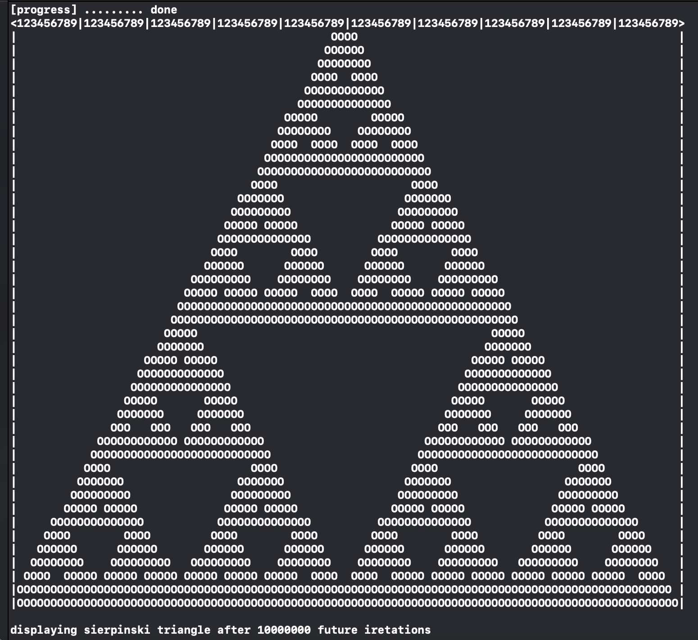

# Ziggurat Receipt Manager

### *Java software that lets you manage your receipts*

---

Sierpinski triangle is a geometric fractal based on equilateral triangles. The sequence begins with one equilateral triangle with any chosen size, and by dividing the sides of the triangle in half a pattern emerges which represents the Sierpinski triangle. If the pattern is continued forever, the triangle will contain an infinite amount of smaller equilateral similar triangles within it.

Sierpinski Triangle Simulator is a C++ algorithm that simulates what the Sierpinski triangle will appear like in *n* iretations. The algorithm uses the Chaos principle to simulate the appearance of the triangle rather than the normal removing triangles technique. The Chaos game states that if a point is placed halfway between two other points, one being a point chosen at random from withing the triangle, and the other chosen at random being from the original triangle, after n iretations the cluster of points will resemble the Sierpinski triangle.

This project follows the Chaos game principles by randomly selecting two points and creating a new point located in the middle of them. The algorithm repeats this process n-times, which is the amount of iretations indicated by the user at the beginning of the program. After cicling through all the iretations, the algorithm creates a simple grid and displays each point on it. Due to the size constraint of the graphical display of the triangle, after a certain point all irritations will look the same.

Sierpinski Triangle Simulator is registered under the GNU GPLv3 software license and its source-code is avaiable on github.

[Sierpinski Triangle Download](https://github.com/vladi443/triangle-fractal/tree/main){: .btn .btn-blue .mr-2}
[Sierpinski Triangle on Github](https://github.com/vladi443/triangle-fractal/tree/main){: .btn .mr-2}
[Learn more about Sierpinski Triangle](https://mathigon.org/course/fractals/sierpinski){: .btn }
